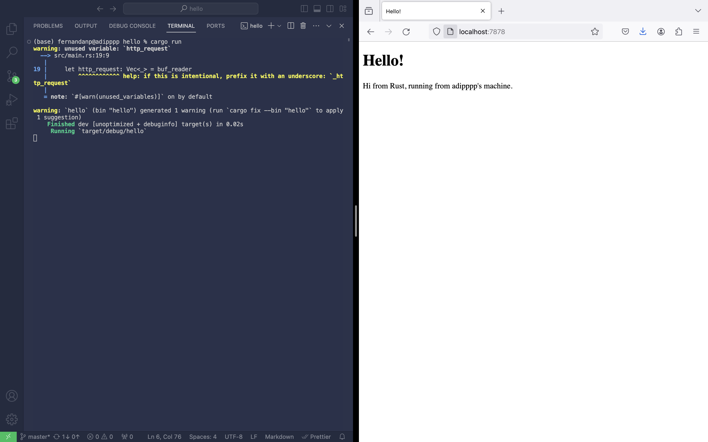
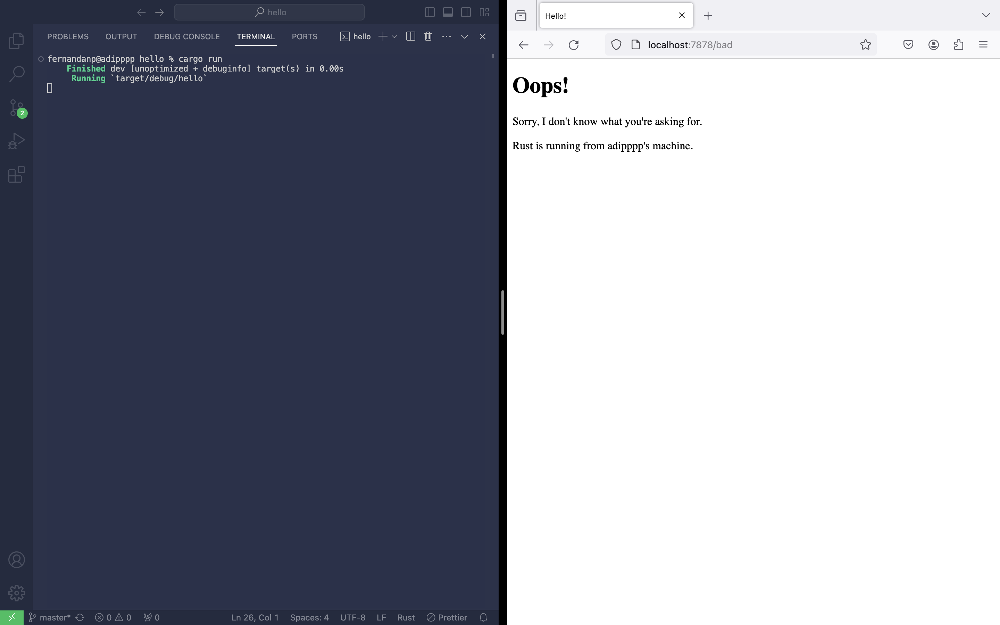

# advprog-modul6

## Reflection 1
Pertama, function `handle_connection()` menerima argument `stream` yang merupakan instance dari `TcpListener`. Argument `stream` tersebut kemudian akan di-<i>wrap</i> oleh sebuah `BufReader` untuk mempercepat operasi read dari stream tersebut. Kemudian, method `lines()` akan mengembalikan sebuah iterator `Lines` terhadap setiap `Option` baris yang dibaca oleh `buf_reader`. Selanjutnya, method `map()` akan melakukan mapping terhadap setiap `Option` baris dalam `Lines` dan memanggil method `unwrap()` pada setiap `Option`. Baris-baris hasil transformasi tersebut akan disimpan dalam sebuah `Map` baru. Method `take_while()` akan dipanggil pada instance `Map` baru yang sudah dibuat, melakukan filter dengan cara menyimpan baris-baris pada sebuah `Map` sampai sebuah baris kosong ditemukan. Terakhir, method `collect()` mengubah iterator `Map` menjadi sebuah collection dan menyimpan collection tersebut pada variable `http_request`.

Macro `println!()` akan melakukan print collection `http_request` ke console.

## Reflection 2
Function `fs::read_to_string()` berfungsi untuk membaca konten file `hello.html`, kemudian memanggil method `unwrap()` untuk mendapatkan return valuenya. Setelah itu, konten file `hello.html` yang sudah didapatkan dari pemanggilan method `unwrap()` disimpan pada variable `contents`. Variable `response` merupakan sebuah string yang mendefinisikan sebuah HTTP response dengan status line, header Content-Length, dan response body. String tersebut diformat sedemikian rupa sehingga value status line, header Content-Length, dan response body pada string tersebut menggunakan value dari variable `status_line`, `contents`, dan `length` secara berturut-turut. Karena method `stream.write_all()` hanya menerima bytes sebagai argument, kita konversi variable `response` menjadi bentuk bytes menggunakan method `response.as_bytes()`. Terakhir, kita menuliskan HTTP response pada TCP stream untuk dikirimkan kembali kepada pengirim request.



## Reflection 3
```rust
let (status_line, filename) = if request_line == "GET / HTTP/1.1" {
    ("HTTP/1.1 200 OK", "hello.html")
} else {
    ("HTTP/1.1 404 NOT FOUND", "404.html")
};
```
Kode di atas merupakan snippet kode yang diambil dari method `handle_connection()` pada `src/main.rs`. Pada snippet kode tersebut, kita melakukan pengecekan terhadap HTTP request yang diterima dengan cara menambahkan expression if-else yang mengembalikan value `("HTTP/1.1 200 OK", "hello.html")` jika HTTP request tertuju pada path "/" dan value `("HTTP/1.1 404 NOT FOUND", "404.html")` jika HTTP request tertuju pada path selain "/". Value-value yang terdapat dalam tuple tersebut kemudian di-assign ke variable `status_line` dan `filename` secara berurutan. Variable `status_line` kemudian akan digunakan untuk mendefinisikan status dari HTTP response yang akan dikirim, sedangkan variable `filename` akan digunakan untuk mengarahkan function `fs::read_to_string()` ke file yang akan dibaca isinya untuk dikembalikan sebagai response body.

Sebelumnya, saya menulis kode untuk mengecek HTTP request yang diterima sebagai berikut:
```rust
if request_line == "GET / HTTP/1.1" {
    let status_line = "HTTP/1.1 200 OK";
    let contents = fs::read_to_string("hello.html").unwrap();
    let length = contents.len();

    let response = format!(
        "{status_line}\r\nContent-Length: {length}\r\n\r\n{contents}"
    );

    stream.write_all(response.as_bytes()).unwrap();
} else {
    let status_line = "HTTP/1.1 404 NOT FOUND";
    let contents = fs::read_to_string("404.html").unwrap();
    let length = contents.len();

    let response = format!(
        "{status_line}\r\nContent-Length: {length}\r\n\r\n{contents}"
    );

    stream.write_all(response.as_bytes()).unwrap();
}
```
Pada snippet kode tersebut, terlihat bahwa terdapat duplikasi di beberapa tempat. Contohnya, variable `status_line`, `contents`, `length`, dan `response` didefinisikan dua kali pada dua conditional branch yang berbeda. Satu-satunya hal yang membedakan kedua definisi variable tersebut hanyalah value dari variable-variable tersebut. Selain itu, variable `response` dan method `stream.write_all()` memiliki value yang sama pada kedua conditional branch. Kedua hal tersebut merupakan code smell sehingga proses refactoring harus dilakukan. Dengan melakukan refactoring, code smell seperti duplikasi kode dapat dihindarkan sehingga kode terlihat lebih singkat dan rapi.

Berikut image yang menunjukkan response dari GET request ke <a>http://127.0.0.1:7878/bad</a>:



## Reflection 4
Saat sebuah request masuk, program menerima dan memproses request tersebut menggunakan salah satu thread yang tersedia. Jika seluruh thread sibuk, program tidak dapat menerima request sebab tidak ada thread yang dapat memproses request tersebut.

Jika kita lihat di `src/main.rs`, program kita hanya menggunakan satu thread saja, yaitu thread utama (main thread) program. Karena satu-satunya thread pada program hanya bisa digunakan untuk memproses sebuah request, program tidak dapat menerima request lain selama proses tersebut berlangsung. Alhasil, mengirimkan request ke "/sleep" tepat sebelum mengirimkan request ke endpoint "/" membuat request kedua tersebut tertunda, menunggu request pertama selesai menerima response.

## Reflection 5
Sebuah thread pool menyimpan sejumlah thread yang berfungsi untuk menjalankan task yang diberikan kepada thread pool tersebut secara <i>concurrent</i>. Ketika sebuah task diterima oleh thread pool, task tersebut akan masuk ke dalam queue yang berisi tasks yang akan dieksekusi. Kemudian, thread yang sedang tidak mengerjakan task melakukan pengecekan terhadap queue. Jika terdapat sebuah task dalam queue, maka thread tersebut akan mengeluarkan task dari queue dan menjalankan task tersebut. Karena sebuah thread dapat berjalan secara bersamaan, setiap thread dalam sebuah thread pool dapat mengerjakan task yang berbeda-beda dalam satu waktu tanpa harus menunggu thread lain selesai mengerjakan.

Implementasi design pattern thread pool memiliki beberapa kelebihan daripada implementasi thread manual. Salah satu hal yang sangat membedakan implementasi ini dengan implementasi thread manual adalah minimnya alokasi dan dealokasi thread beserta resource yang digunakan thread tersebut. Hal ini terjadi karena thread pool hanya melakukan instansiasi sejumlah thread di awal pembuatan thread pool saja. Selain itu, thread yang sudah selesai mengerjakan sebuah task tidak didealokasikan, tetapi menunggu task baru tersedia dalam internal queue thread pool. Dengan pendekatan ini, overhead pembuatan dan destruksi thread dapat diminimalisasi.
